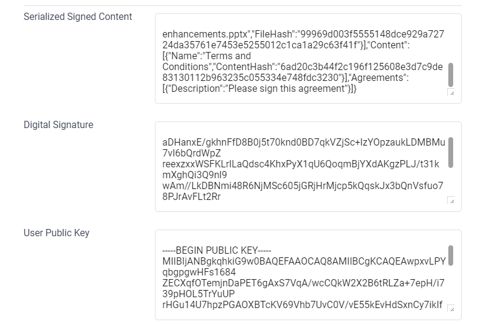
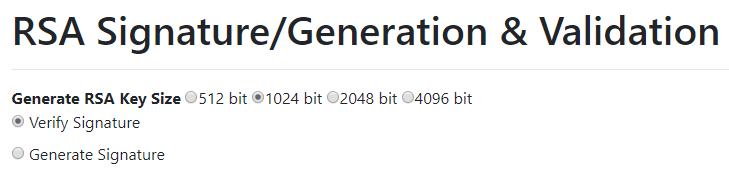
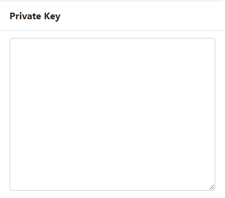
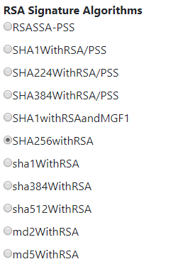
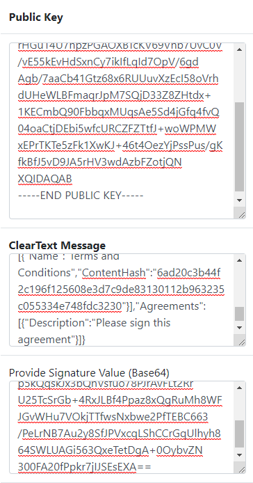
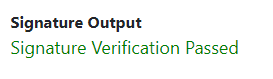

# Digital signatures with Fabric

Welcome. You have probably arrived at this page from our Fabric Digital Signing page to see how you can verify the information that are found in the `Technical Details` section.

To start, you need to decide which tools you are going to use to verify this. There are a couple of 3rd party tools that adhere to the Cryptographic signing standard that will work.

We will list two of them and explain how to use them but before we start, please familiarise yourself with the `Technical Details` page content first.

The `Serialized Signed Content` will be used as the "Original Content". This is the content that we made a signature for.
The `Digital Signature` is the actual signature of the `Serialized Signed Content` but in an encoded form.
The `User Public Key` is the Public Key used to verify that the signature is valid and that the content is not tampered with.

## Online Signature Verification service

This [Online Signature Verification service](https://8gwifi.org/rsasignverifyfunctions.jsp) allows convenience and simple access to verify that the content is correct.

On arriving on the page, it is afvised to make the following adjustments before beginning:

- Select the `Verify Signature` option at the top of the page, just below the heading
  
  
- Clear out the `Private Key` field.

  
- Scrolling down, you will notice a list of `RSA Signature Algorithms`. Choose the `SHA256withRSA` one.

  

Please then copy the `Serialized Signed Content` into the `ClearText Message` text block, `Digital Signature` into the `Provide Signature Value` text block and the `User Public Key` intot the `Public Key` text block. Like so:

Once that is done, you will notice that a loading indicator appears, follwed by the result of the information that is pasted into the site.

## OpenSSL command-line
